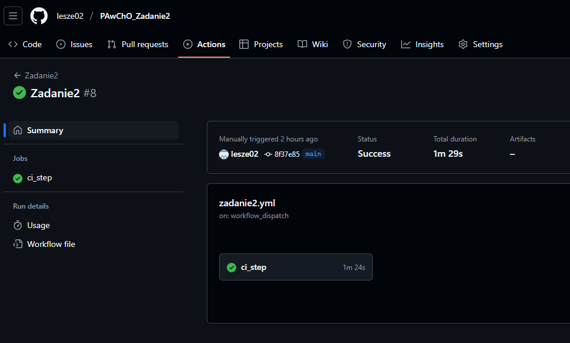

## Łańcuch (pipeline):
```
name: Zadanie2

on:
  workflow_dispatch:
  push:
    tags:
    - 'v*'

jobs:
  ci_step:
    runs-on: ubuntu-latest

    steps:
      -
        name: Check out the source_repo
        uses: actions/checkout@v4

      -
        name: Docker metadata definitions
        id: meta
        uses: docker/metadata-action@v5
        with:
          images: ghcr.io/lesze02/zadanie2
          flavor: latest=false
          tags: |
            type=sha,priority=100,prefix=sha-,format=short
            type=semver,priority=200,pattern={{version}}
      
      -
        name: QEMU setup
        uses: docker/setup-qemu-action@v3

      -
        name: Buildx setup
        uses: docker/setup-buildx-action@v3

      -
        name: DockerHub login
        uses: docker/login-action@v3
        with:
          username: ${{ vars.DOCKERHUB_USERNAME }}
          password: ${{ secrets.DOCKERHUB_TOKEN }}

      -
        name: GHCRio login
        uses: docker/login-action@v3
        with:
          registry: ghcr.io
          username: ${{ github.actor }}
          password: ${{ secrets.CR_PAT }}

      -
        name: Build for test
        uses: docker/build-push-action@v5
        with:
          context: .
          file: ./Dockerfile
          platforms: linux/amd64,linux/arm64
          push: true
          cache-from: |
            type=registry,ref=${{ vars.DOCKERHUB_USERNAME }}/zadanie2_cache
          cache-to: |
            type=registry,ref=${{ vars.DOCKERHUB_USERNAME }}/zadanie2_cache, mode=max
          tags: ${{ vars.DOCKERHUB_USERNAME }}/zadanie2test:sha-${{ github.sha }}

      -
        name: Test CVE
        uses: aquasecurity/trivy-action@0.30.0
        with:
          image-ref: ${{ vars.DOCKERHUB_USERNAME }}/zadanie2test:sha-${{ github.sha }}
          format: json
          exit-code: 1
          severity: CRITICAL,HIGH

      -
        name: Build and push
        if: success()
        uses: docker/build-push-action@v5
        with:
          context: .
          file: ./Dockerfile
          platforms: linux/amd64,linux/arm64
          push: true
          cache-from: |
            type=registry,ref=${{ vars.DOCKERHUB_USERNAME }}/zadanie2_cache
          cache-to: |
            type=registry,ref=${{ vars.DOCKERHUB_USERNAME }}/zadanie2_cache, mode=max
          tags: ${{ steps.meta.outputs.tags }}

```

## Opis wykonania zadania
Do testowania CVE wykorzystano narzędzie trivy (źródło: https://thomasthornton.cloud/2025/03/18/setting-up-trivy-in-your-github-actions/). Dzięki niemu możliwe było sprawdzenie, czy obraz nie zawiera błędów na poziomie CRITICAL lub HIGH. Trivy jest bardzo wygodnym narzędziem podczas stosowania w GitHub Actions - jest open source, posiada szybkie skanowanie oraz bezpośrednią integrację z GitHub. 

W celu zrealizowania podpunktu c wykorzystano prywatne repozytorium DockerHub:

    https://hub.docker.com/r/lesze/zadanie2test

Obraz zbudowany w celu przetestowania jest tam przesyłany, następnie wykonywany jest test CVE i jeśli nie wykryto żadnych nieprawidłowości jest on już finalnie przesyłany do publicznego repozytorium ghcr.io:

    https://ghcr.io/lesze02/zadanie2

zgodnie z założeniami podpunktu. Początkowo obraz miał być testowany lokalnie, jednak wystąpiły problemy podczas budowania lokalnie obrazu na dwie architektury. Dane cache znajdują się pod tym linkiem:

    https://hub.docker.com/r/lesze/zadanie2_cache

## Uruchomienie 
Pipeline można uruchomić bezpośrednio na stronie repozytorium GitHub, lub poprzez wypchnięcie taga w odpowiednim formacie, zawierającym "v", np. v.1.0.0. Poniższy zrzut ekranu przedstawia poprawność działania łańcucha GitHub Actions:
